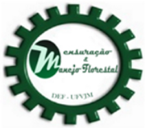

# App Economia Florestal

asdasdasdsa asdasdasdsa asdasdasdsa asdasdasdsa asdasdasdsa asdasdasdsa asdasdasdsa asdasdasdsa asdasdasdsa asdasdasdsa asdasdasdsa asdasdasdsa asdasdasdsa asdasdasdsa asdasdasdsa asdasdasdsa asdasdasdsa asdasdasdsa asdasdasdsa asdasdasdsa asdasdasdsa asdasdasdsa asdasdasdsa asdasdasdsa asdasdasdsa asdasdasdsa asdasdasdsa asdasdasdsa asdasdasdsa asdasdasdsa asdasdasdsa asdasdasdsa asdasdasdsa asdasdasdsa asdasdasdsa asdasdasdsa asdasdasdsa asdasdasdsa asdasdasdsa asdasdasdsa asdasdasdsa asdasdasdsa asdasdasdsa asdasdasdsa asdasdasdsa asdasdasdsa asdasdasdsa asdasdasdsa asdasdasdsa asdasdasdsa asdasdasdsa asdasdasdsa asdasdasdsa asdasdasdsa asdasdasdsa asdasdasdsa asdasdasdsa asdasdasdsa asdasdasdsa asdasdasdsa asdasdasdsa asdasdasdsa asdasdasdsa asdasdasdsa asdasdasdsa asdasdasdsa asdasdasdsa asdasdasdsa asdasdasdsa asdasdasdsa asdasdasdsa asdasdasdsa asdasdasdsa asdasdasdsa asdasdasdsa asdasdasdsa asdasdasdsa asdasdasdsa asdasdasdsa asdasdasdsa .

#### Script criado por:

[Sollano Rabelo Braga](http://lattes.cnpq.br/7271838547135276 "Curriculum Lattes"), [Eric Bastos Gorgens](http://lattes.cnpq.br/2266409430041146 "Curriculum Lattes") 

#### Para citar e referenciar este app, utilize:

(BRAGA; GORGENS, 2019)

BRAGA, S. R.; GORGENS, E. B; OLIVEIRA, M. L. R. DE. App Economia Florestal: Aplicativo shiny para processamento de dados de economia florestal, 2019. Disponível em: <http://gorgens.wixsite.com/treelab>.

